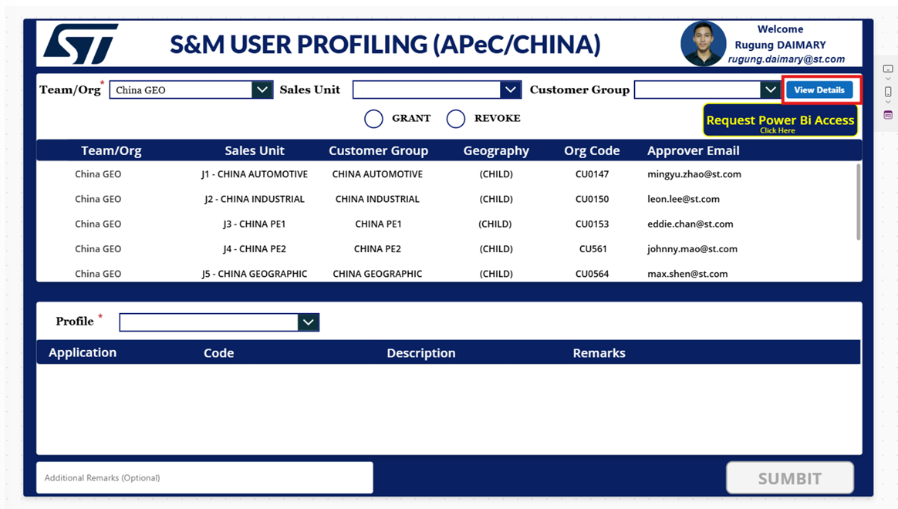
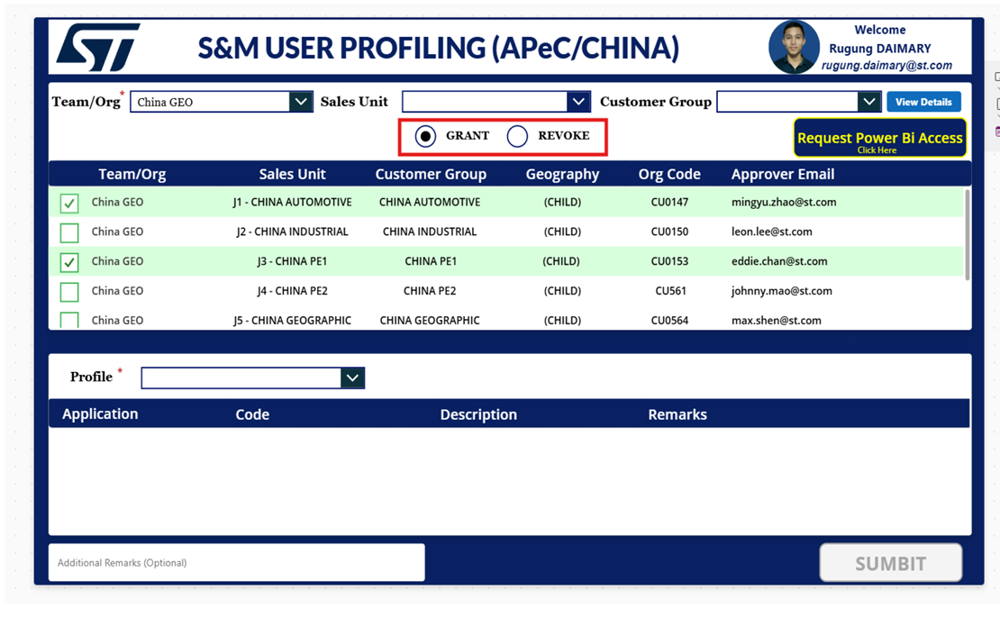
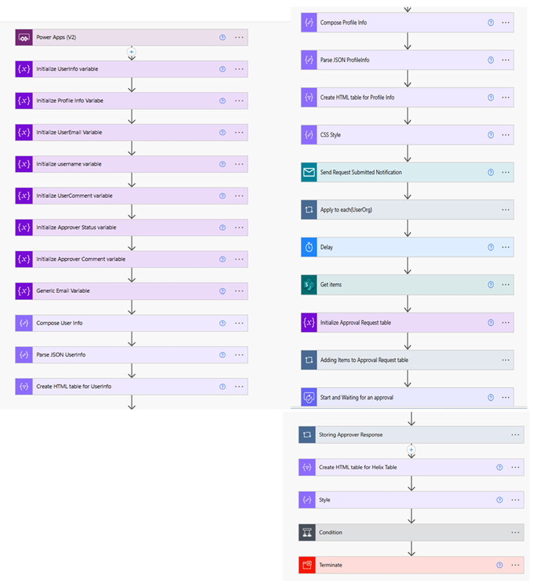
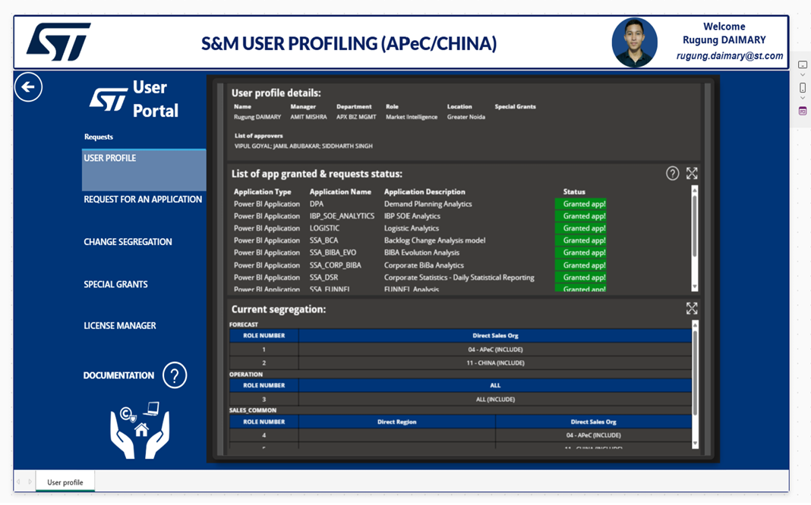
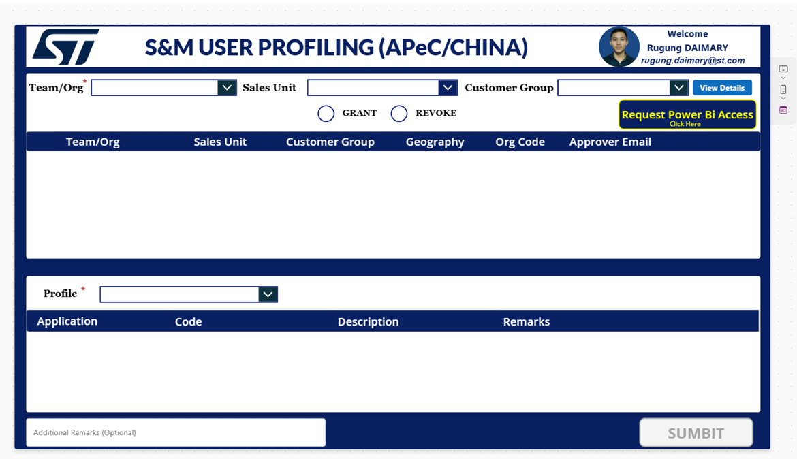
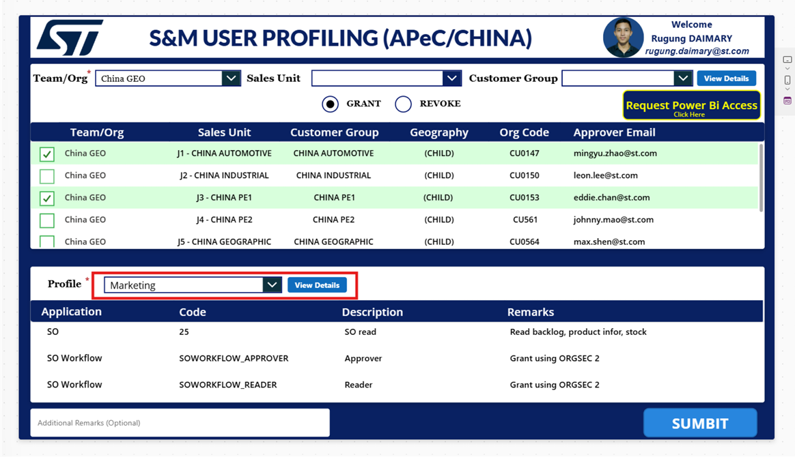
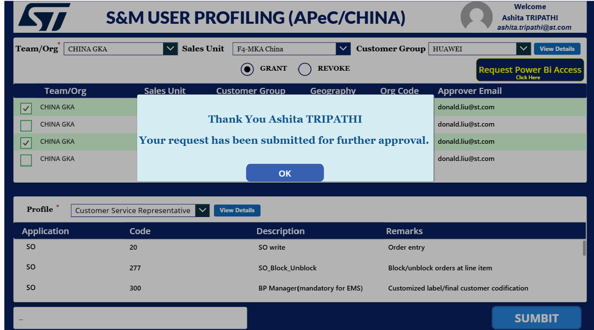
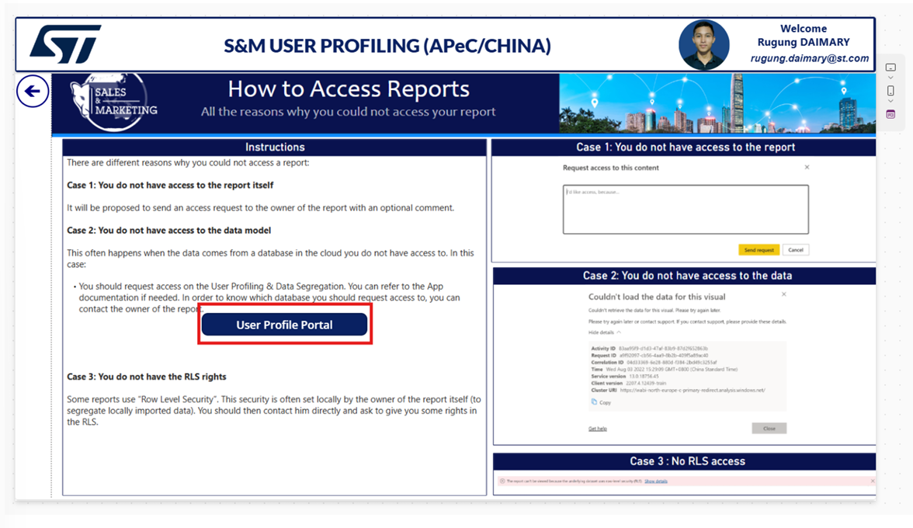

#  User Profiling App

A comprehensive Microsoft Power Platform solution that streamlines user access management for Sales & Marketing (S&M) teams in APeC and China regi## 📄 Docum## 🔄 Process Transformation

### **AS-IS## 📄 Documentation

### **Technical Documentation**
- `User Profiling App Documentation.pdf` - Complete technical documentation with screenshots
- `docs/ARCHITECTURE.md` - Comprehensive system architecture and technical design
- `docs/TECHNICAL_SPECIFICATIONS.md` - Detailed technical specifications matching actual implementation
- `docs/DEPLOYMENT_GUIDE.md` - Comprehensive deployment and implementation guide

### **Business Documentation**  
- `docs/BUSINESS_CASE.md` - Business case, ROI analysis, and strategic justification
- `Profiling2.3.pptx` - Business presentation overview and process walkthrough

### **Project Assets**
- `docs/IMAGE_EXTRACTION_GUIDE.md` - Guide for extracting and managing screenshots
- `images/` - Application screenshots and visual documentation
- `Old Version/` - Previous iterations and backup files for references (Current State)**
The traditional process involves several pain points:
1. **Manual Form Filling**: Users complete complex forms without guidance
2. **Helix Ticket Creation**: Manual ticket creation with limited visibility
3. **Knowledge Gaps**: Users lack understanding of:
   - Available applications and their functions
   - ST data segregation perimeters  
   - Appropriate approver hierarchies
4. **Multiple Iterations**: Imprecise requests lead to back-and-forth communications
5. **Prolonged Response Times**: Manual processing causes significant delays

### **TO-BE Process (Transformed State)**
The new streamlined process provides:
1. **Self-Service Portal**: Intuitive interface with guided workflows
2. **Intelligent Suggestions**: System recommends appropriate applications and profiles
3. **Clear Visibility**: Built-in approver matrix and process transparency
4. **Automated Routing**: Smart workflow management reduces manual intervention
5. **Real-Time Tracking**: Users can monitor request progress in real-time

### **Transformation Benefits**
- **50-60% Reduction** in processing time
- **70% Fewer Iterations** due to precise initial requests  
- **Enhanced User Experience** through self-service capabilities
- **Improved Compliance** with standardized approval processes
- **Better Analytics** for organizational insightsTechnical Documentation**
- `User Profiling App Documentation.pdf` - Complete technical documentation with screenshots
- `docs/ARCHITECTURE.md` - System architecture diagram and technical details
- `docs/DEPLOYMENT_GUIDE.md` - Comprehensive deployment and implementation guide

### **Business Documentation**  
- `docs/BUSINESS_CASE.md` - Business case, ROI analysis, and strategic justification
- `Profiling2.3.pptx` - Business presentation overview and process walkthrough
- `docs/IMAGE_EXTRACTION_GUIDE.md` - Guide for extracting and managing screenshots

### **Legacy & Backup**
- `Old Version/` - Previous iterations and backup files for reference

## 🔧 Customization & Extensions

The application architecture supports various customization options:

### **Regional Adaptations**
- **Multi-Geography Support**: Extend beyond APeC/China to other regions
- **Localization**: Support for multiple languages and regional requirements
- **Currency/Business Rules**: Adapt to regional business practices

### **Organizational Extensions**
- **Department Expansion**: Add support for other departments beyond S&M
- **Role-Based Customization**: Tailor workflows for different organizational roles
- **Integration Extensions**: Connect with additional enterprise systems

### **Technical Enhancements**
- **Advanced Analytics**: Enhanced Power BI dashboards and predictive analytics
- **Mobile Optimization**: Enhanced mobile experience and offline capabilities
- **API Extensions**: Additional integrations with third-party systemsnterface](images/main-interface.png)
*S&M User Profiling application main interface*

## 📋 Overview

This application addresses critical challenges in STMicroelectronics' user access management process by providing a streamlined, self-service portal for Sales & Marketing users in APeC and China regions. Built using Microsoft Power Platform, it eliminates the complexity of manual form filling and ticket creation through Helix.

### **Business Problem Solved:**
- **Complex Manual Process**: Users previously had to create tickets via Helix without clear guidance
- **Knowledge Gap**: New users lacked understanding of available applications, functions, and data segregation
- **Inefficient Approvals**: Multiple iterations due to imprecise requests led to prolonged response times
- **Poor User Experience**: Existing process was cumbersome and time-consuming

### **Solution Benefits:**
- **Self-Service Portal**: Users can easily request access with guided workflows  
- **Clear Application Mapping**: Shows available applications, functions, and approval matrices
- **Streamlined Approvals**: Automated routing to appropriate approvers
- **Enhanced Efficiency**: Reduced iterations and faster response times
- **User-Friendly Interface**: Intuitive design for both new and existing users

*System architecture showing integrated components and data flow*

## 🚀 Key Features

### **For New Users:**
- **Guided Application Discovery**: Clear visibility into available applications and their functions
- **Data Segregation Guidance**: Understanding of ST data segregation perimeters  
- **Approver Matrix Visibility**: Know exactly who will approve specific requests
- **Intelligent Profiling**: System suggests appropriate profiles based on role/region

### **For Existing Users:**
- **Access Expansion**: Request additional application access seamlessly
- **Access Revocation**: Remove granted access when no longer needed
- **Profile Management**: Update and modify existing access profiles

### **System Capabilities:**
- **Automated Workflow Integration**: Direct integration with Helix ticketing system
- **Multi-Region Support**: Specialized for APeC and China S&M operations  
- **Real-time Status Tracking**: Monitor request progress through approval pipeline
- **Power BI Analytics**: Access to usage reports and analytics dashboards

*User interface showing populated organizational data for China GEO teams*

## 🏗️ Architecture

The system follows a multi-layer architecture integrating Power Platform components:

### Components
- **Power Apps Application** (`ProfilingApp_PowerApps.msapp`)
  - S&M User Profiling interface for APeC/CHINA region
  - Team/Organization selection with dropdown menus
  - Grant/Revoke request functionality
  - Profile-based access management

*Grant/Revoke selection interface with team checkboxes*

- **Power Automate Workflows** (`ProfilingApp_PowerAutomate_*.zip`)
  - Automated approval routing processes
  - Helix team integration workflows
  - Email notification systems
  - Request status tracking

*Complete automated workflow from request to Helix team processing*

- **User Profile Portal**
  - Dedicated portal for viewing profile details
  - Application status tracking
  - Current segregation management
  - License manager functionality

*User Portal showing profile details and application status*

- **Data Sources** (Excel Files)
  - `User_Details.xlsx` - Personal user information and contact details
  - `User_Org.xlsx` - Organizational structure (Teams, Sales Units, Customer Groups)
  - `User_Profile.xlsx` - Profile-specific access permissions and applications

## 📊 Data Structure

The application manages organizational data for STMicroelectronics China operations:

### Team/Organization Structure:
- **China GEO** - Main geographical organization
- **Sales Units**: J1-CHINA AUTOMOTIVE, J2-CHINA INDUSTRIAL, J3-CHINA PE1, J4-CHINA PE2, J5-CHINA GEOGRAPHIC
- **Customer Groups**: CHINA AUTOMOTIVE, CHINA INDUSTRIAL, CHINA PE1, CHINA PE2, CHINA GEOGRAPHIC
- **Geography**: (CHILD) organizational level
- **Org Codes**: CU0147, CU0150, CU0153, CU561, CU0564

### Profile Types:
- **Marketing Profile**: Includes SO read, SO Workflow (Approver/Reader), Corporate BI& Analytics
- **Customer Service Representative**: Order entry, blocking/unblocking capabilities, EMS management
- **Custom Profiles**: Based on specific business requirements

## 🛠️ Setup Instructions

### Prerequisites
- Microsoft Power Platform environment
- Power Apps license
- Power Automate license
- Power BI Pro license (for dashboard)
- Excel Online or SharePoint for data sources

### Installation Steps
1. **Import Power Apps Application**
   - Download `ProfilingApp_PowerApps.msapp`
   - Import into your Power Apps environment
   - Configure data connections

2. **Deploy Power Automate Flows**
   - Extract and import workflows from `ProfilingApp_PowerAutomate_*.zip`
   - Configure connections and permissions

3. **Setup Power BI Dashboard**
   - Open `PROFILING APP PBI.pbix` in Power BI Desktop
   - Configure data source connections
   - Publish to Power BI Service

4. **Configure Data Sources**
   - Upload Excel files to SharePoint or OneDrive
   - Update data connections in Power Apps and Power BI

## 📱 Usage

### Application Workflow:

#### 1. **Initial Request Form**

*Users start with the main S&M User Profiling interface*

#### 2. **Team/Organization Selection**
- Select Team/Organization (mandatory field)
- Choose Sales Unit from dropdown
- Select Customer Group
- System populates related organizational data

#### 3. **Grant or Revoke Selection**

*Users select Grant or Revoke and choose specific teams/profiles*

- Choose between **GRANT** or **REVOKE** request
- Select specific teams using checkboxes
- Choose appropriate profile (Marketing, Customer Service Representative, etc.)
- View associated applications and permissions

#### 4. **Request Submission**

*Confirmation message after successful request submission*

- Review selections and add optional remarks
- Click **SUBMIT** to send request
- Receive confirmation popup
- Request enters automated approval workflow

#### 5. **Power BI Access**

*Integrated guide for accessing Power BI reports and dashboards*

- Use **"Request Power BI Access"** button for analytics access
- Follow provided instructions for different access scenarios
- Access User Profile Portal for detailed information

## � Automated Workflow Process

The application integrates with Helix team for complete request processing:

### Workflow Steps:
1. **User Submission** - Request submitted through Power Apps interface
2. **Power Automate Processing** - Automated workflow triggers
3. **Approval Routing** - Request routed to appropriate approvers
4. **Helix Team Integration** - Approved requests sent to Helix team
5. **Implementation** - Helix team implements the requested changes
6. **Notification** - Users receive status updates throughout the process

### Power Automate Components:
- User profile validation and processing
- Email notification systems
- Approval workflow management
- Helix team integration APIs
- Status tracking and reporting

## � Documentation

- `User Profiling App Documentation.pdf` - Complete technical documentation with screenshots
- `Profiling2.3.pptx` - Presentation overview and system walkthrough
- `docs/ARCHITECTURE.md` - System architecture diagram and technical details
- `docs/IMAGE_EXTRACTION_GUIDE.md` - Guide for extracting and managing screenshots
- `Old Version/` - Previous iterations and backup files

## � Customization

The application can be customized for different organizations:
- **Regional Adaptations**: Modify for different geographical regions
- **Organizational Structure**: Adapt team/org hierarchies
- **Profile Types**: Add custom profiles based on business needs
- **Approval Workflows**: Customize approval routing logic
- **Integration Points**: Connect with different backend systems (beyond Helix)

## 📈 Analytics & Reporting

The Power BI integration provides comprehensive insights:
- **User Access Patterns**: Track profile usage and access requests
- **Organizational Distribution**: Visualize team and geography-based metrics  
- **Request Analytics**: Monitor grant/revoke request trends
- **Approval Metrics**: Track approval times and bottlenecks
- **Helix Integration Status**: Monitor backend processing efficiency

## 🤝 Contributing

1. Fork the repository
2. Create a feature branch
3. Make your changes
4. Test the modifications
5. Submit a pull request

## 📄 License

This project is licensed under the MIT License - see the LICENSE file for details.

## 🆘 Support

For support and questions:
- Review the documentation in `User Profiling App Documentation.pdf`
- Check the presentation materials in `Profiling2.3.pptx`
- Create an issue in this repository

## 🔄 Version History

- **Current Version**: Latest iteration with all components
- **Previous Versions**: Available in `Old Version/` folder

---

**Note**: This solution requires appropriate Microsoft Power Platform licenses and permissions to deploy and use effectively.
