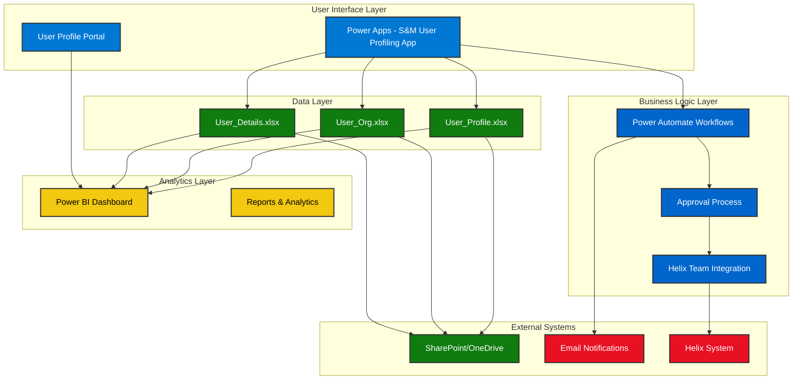

```mermaid
graph TB
    subgraph "User Interface Layer"
        A[Power Apps - S&M User Profiling App]
        B[User Profile Portal]
    end
    
    subgraph "Business Logic Layer"
        C[Power Automate Workflows]
        D[Approval Process]
        E[Helix Team Integration]
    end
    
    subgraph "Data Layer"
        F[User_Details.xlsx]
        G[User_Org.xlsx] 
        H[User_Profile.xlsx]
    end
    
    subgraph "Analytics Layer"
        I[Power BI Dashboard]
        J[Reports & Analytics]
    end
    
    subgraph "External Systems"
        K[SharePoint/OneDrive]
        L[Email Notifications]
        M[Helix System]
    end
    
    A --> C
    A --> F
    A --> G
    A --> H
    B --> I
    C --> D
    C --> L
    D --> E
    E --> M
    F --> I
    G --> I
    H --> I
    F --> K
    G --> K
    H --> K
    
    classDef powerApps fill:#0078d4,stroke:#333,stroke-width:2px,color:#fff
    classDef powerAutomate fill:#0066cc,stroke:#333,stroke-width:2px,color:#fff
    classDef powerBI fill:#f2c811,stroke:#333,stroke-width:2px,color:#000
    classDef data fill:#107c10,stroke:#333,stroke-width:2px,color:#fff
    classDef external fill:#e81123,stroke:#333,stroke-width:2px,color:#fff
    
    class A,B powerApps
    class C,D,E powerAutomate
    class I,J powerBI
    class F,G,H,K data
    class L,M external
```
