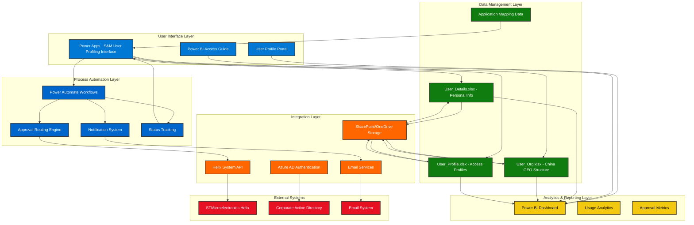

# STMicroelectronics User Profiling App - Technical Architecture

## 🏗️ System Overview

The STMicroelectronics User Profiling App is built on Microsoft Power Platform, providing a comprehensive solution for S&M user access management in APeC and China regions.

## 📐 Architecture Diagram



## 🔄 Application Flow

### **1. User Request Initiation**
```
User Access → Power Apps Interface → Team/Org Selection → Grant/Revoke Choice
```

### **2. Data Population**
```
Org Selection → User_Org.xlsx Lookup → Populate Sales Units → Display Customer Groups
```

### **3. Profile Selection**
```
Profile Dropdown → User_Profile.xlsx → Application Mapping → Display Available Apps
```

### **4. Approval Workflow**
```
Submit Request → Power Automate Trigger → Approval Routing → Email Notifications
```

### **5. Helix Integration**
```
Approved Request → Helix API Call → Ticket Creation → Implementation Tracking
```

## 🏛️ Technical Components

### **Power Apps Application**
- **Main Interface**: S&M User Profiling form with dropdowns and selections
- **User Profile Portal**: Dedicated portal for viewing profile details and status
- **Power BI Access Guide**: Integrated help system for analytics access

**Key Features:**
- Dynamic dropdown population based on organizational hierarchy
- Real-time validation of user selections
- Grant/Revoke toggle functionality with conditional logic
- Integrated help and guidance system

### **Power Automate Workflows**
- **Request Processing Flow**: Handles form submissions and validation
- **Approval Routing Flow**: Manages approval hierarchy and notifications
- **Helix Integration Flow**: Communicates with external Helix system
- **Status Update Flow**: Provides real-time status updates to users

**Workflow Components:**
- Conditional approval routing based on request type
- Email notification system for all stakeholders
- Error handling and retry mechanisms
- Audit trail generation

### **Data Architecture**

#### **User_Org.xlsx Structure**
```
Team/Org | Sales Unit | Customer Group | Geography | Org Code | Approver Email
---------|------------|----------------|-----------|----------|---------------
China GEO | J1-CHINA AUTO | CHINA AUTO | (CHILD) | CU0147 | approver@st.com
```

#### **User_Profile.xlsx Structure**
```
Profile Name | Application | Code | Description | Remarks
-------------|-------------|------|-------------|--------
Marketing | SO | 25 | SO read | Read backlog, product info
Marketing | SO Workflow | SOWORKFLOW_APPROVER | Approver | Grant using ORG&SC 2
```

#### **User_Details.xlsx Structure**
```
User ID | Name | Email | Department | Manager | Location
--------|------|-------|------------|---------|----------
```

### **Integration Points**

#### **Helix System Integration**
- **API Endpoint**: RESTful API for ticket creation and status updates
- **Authentication**: Service account with appropriate permissions
- **Data Mapping**: Request details mapped to Helix ticket fields
- **Status Synchronization**: Bi-directional status updates

#### **SharePoint/OneDrive Integration**
- **Data Storage**: Excel files stored in SharePoint document library
- **Version Control**: Automatic versioning and backup
- **Access Control**: Role-based permissions for data access
- **Refresh Mechanism**: Scheduled data refresh for Power BI

## 🔒 Security Architecture

### **Authentication & Authorization**
- **Azure AD Integration**: Single sign-on with corporate credentials
- **Role-Based Access Control**: Different permissions for users, approvers, admins
- **Data-Level Security**: Row-level security based on organizational hierarchy

### **Data Security**
- **Encryption in Transit**: HTTPS for all communications
- **Encryption at Rest**: SharePoint/OneDrive native encryption
- **Audit Logging**: Complete audit trail of all actions
- **Data Loss Prevention**: DLP policies to prevent unauthorized data sharing

## 📊 Performance Considerations

### **Scalability**
- **Concurrent Users**: Designed to support 500+ concurrent users
- **Data Volume**: Optimized for organizational data of 10,000+ records
- **Response Time**: Target <2 seconds for all user interactions

### **Availability**
- **Service Level**: 99.5% uptime target
- **Disaster Recovery**: Automatic backup and recovery mechanisms
- **Monitoring**: Application insights and performance monitoring

## 🔧 Technical Requirements

### **Licensing**
- **Power Apps**: Per-user or per-app licenses
- **Power Automate**: Per-user licenses for workflow automation
- **Power BI**: Pro licenses for analytics and reporting
- **SharePoint**: Included in Office 365 E3/E5 licenses

### **Infrastructure**
- **Power Platform Environment**: Dedicated production environment
- **SharePoint Online**: Document storage and data source hosting
- **Azure AD**: Authentication and user management
- **Office 365**: Email and collaboration services

## 🚀 Deployment Architecture

### **Environments**
- **Development**: Development and unit testing
- **Test/UAT**: User acceptance testing and integration testing  
- **Production**: Live system for end users

### **Deployment Process**
- **Solution Packaging**: Power Platform solutions for deployment
- **Configuration Management**: Environment-specific configurations
- **Data Migration**: Structured approach for data source setup
- **Rollback Strategy**: Ability to revert to previous version if needed

---

**Note**: This architecture supports the current requirements while providing flexibility for future enhancements and organizational growth.
